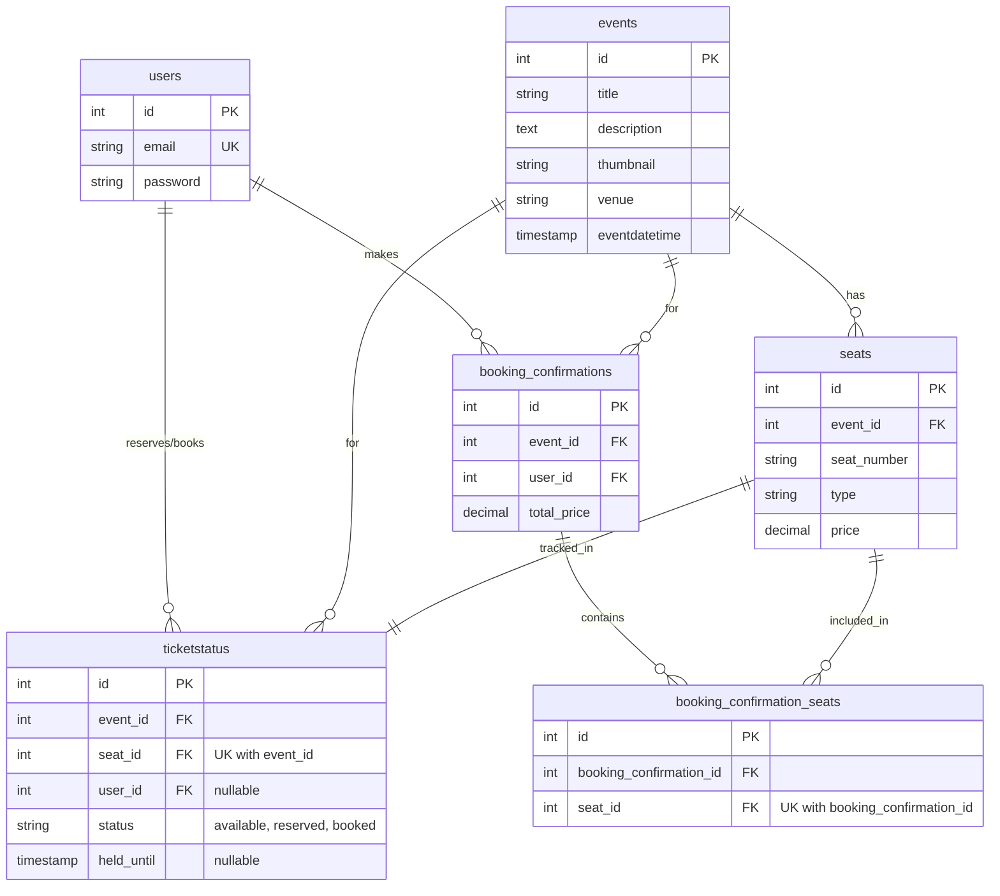

## 🚀 Backend API Setup Guide

### 📦 Database Setup

#### Step 1: Launch PostgreSQL Container

Run the following Docker command to create and start a PostgreSQL container:

```bash
docker run -d \
    --name node-postgres-db \
    -e POSTGRES_USER=postgres \
    -e POSTGRES_PASSWORD=postgres \
    -e POSTGRES_DB=ticket-booking-app \
    -p 5432:5432 \
    postgres
```

#### Step 2: Connect via pgAdmin

- Install [pgAdmin](https://www.pgadmin.org/download/)
- Create a new server connection with the following credentials:
  - **Host:** `localhost`
  - **Port:** `5432`
  - **Username:** `postgres`
  - **Password:** `postgres`
  - **Database:** `ticket-booking-app`

#### Step 3: Initialize Database Schema

Execute the `final-schema.sql` file (located in the project root) to create all required tables.

#### Step 4: Seed Sample Data

Run the `data-seed.sql` file to populate the database with sample data for testing and development.

---

> ✅ Your database is now ready to use!

### 🔧 API Setup

#### Step 1: Install Dependencies

Install the required packages using npm:

```bash
npm install
```

#### Step 2: Configure Environment Variables

Refer to the `.env.example` file and create a `.env` file with all the necessary environment variables.

#### Step 3: Start the Development Server

Run the following command to start the API server:

```bash
npm run dev
```

---

> ✅ Your API server is now running!

### Entity Relationship Diagram



## API Endpoints

### 1. Fetch all events

**Endpoint:** `GET /api/v1/event`

**Description:** Returns a list of all the events in the system

**Response:**

```json
{
  "success": true,
  "data": [
    {
      "id": 1,
      "title": "Rock Legends Live Concert",
      "description": "Experience an unforgettable night with the greatest rock bands of all time. Featuring electric guitar solos, powerful drum beats, and classic rock anthems that will make you jump to your feet!",
      "thumbnail": "https://images.unsplash.com/photo-1470229722913-7c0e2dbbafd3",
      "venue": "Madison Square Garden, New York",
      "eventdatetime": "2026-03-15T13:45:00.000Z"
    },
    {
      "id": 2,
      "title": "Comedy Night with Sarah Chen",
      "description": "Get ready to laugh until your sides hurt! Award-winning comedian Sarah Chen brings her hilarious new show with fresh jokes about everyday life, relationships, and the absurdities of modern technology.",
      "thumbnail": "https://images.unsplash.com/photo-1585699324551-f6c309eedeca",
      "venue": "Hollywood Bowl, Los Angeles",
      "eventdatetime": "2026-04-22T14:15:00.000Z"
    },
    {
      "id": 3,
      "title": "Classical Symphony Orchestra",
      "description": "Immerse yourself in the timeless beauty of classical music. The Metropolitan Orchestra performs Beethoven, Mozart, and Tchaikovsky under the baton of renowned conductor Marcus Williams.",
      "thumbnail": "https://images.unsplash.com/photo-1465847899084-d164df4dedc6",
      "venue": "Carnegie Hall, New York",
      "eventdatetime": "2026-05-10T12:15:00.000Z"
    },
    {
      "id": 4,
      "title": "EDM Festival 2026",
      "description": "The biggest electronic dance music festival of the year! Featuring world-class DJs, mind-blowing visuals, laser shows, and non-stop beats that will keep you dancing all night long.",
      "thumbnail": "https://images.unsplash.com/photo-1514320291840-2e0a9bf2a9ae",
      "venue": "Las Vegas Convention Center, Nevada",
      "eventdatetime": "2026-06-20T15:15:00.000Z"
    },
    {
      "id": 5,
      "title": "Jazz & Blues Evening",
      "description": "A sophisticated evening of smooth jazz and soulful blues. Enjoy world-class musicians performing intimate sets in a cozy atmosphere. Wine and cocktails available.",
      "thumbnail": "https://images.unsplash.com/photo-1415201364774-f6f0bb35f28f",
      "venue": "Blue Note Jazz Club, Chicago",
      "eventdatetime": "2026-07-08T13:15:00.000Z"
    }
  ],
  "message": "Events fetched successfully"
}
```

### 2. Get Event Details

**Endpoint:** `GET /api/v1/event/:eventId`

**Description:** Retrieves event information with seat availability.

**Response:**

```json
{
  "success": true,
  "data": {
    "id": 1,
    "title": "Rock Legends Live Concert",
    "description": "...",
    "venue": "Madison Square Garden",
    "eventdatetime": "2026-03-15T19:30:00Z",
    "total_seats": 100,
    "available_seats": 85,
    "reserved_seats": 10,
    "booked_seats": 5,
    "seats": [
      {
        "seat_id": 1,
        "seat_number": "VIP-A1",
        "seat_type": "VIP",
        "price": 100.0,
        "status": "AVAILABLE",
        "seconds_remaining": null
      },
      {
        "seat_id": 2,
        "seat_number": "VIP-A2",
        "seat_type": "VIP",
        "price": 100.0,
        "status": "RESERVED",
        "seconds_remaining": 450
      }
    ]
  },
  "message": "Event fetched successfully"
}
```

### 3. Reserve Seats

**Endpoint:** `PUT /api/v1/booking/reserve`

**Description:** Reserves one or more seats for 10 minutes, allowing the user to complete payment.

**Request Body:**

```json
{
  "userId": 1,
  "eventId": 1,
  "seatIds": [101, 102, 103]
}
```

**Response:**

```json
{
  "success": true,
  "data": {
    "eventId": 1,
    "reservedSeatIds": [101, 102, 103]
  },
  "message": "Seats reserved successfully"
}
```

### 4. Confirm Seats

**Endpoint:** `PUT /api/v1/booking/confirm`

**Description:** Confirm the reserved seats by completing the payment

**Request Body:**

```json
{
  "eventId": 1,
  "reservedSeatIds": [101, 102, 103]
}
```

**Response:**

```json
{
  "success": true,
  "data": {
    "bookingConfirmationId": 123,
    "eventId": 1,
    "reservedSeatIds": [101, 102, 103]
  },
  "message": "Seats booked successfully"
}
```

### 🏗️ Architecture Decisions

#### 1. Concurrency Control and Prevent Double Booking

**Problem:** Without proper handling, two users could book the same seat.

**Solution: Atomic Operations**

```javascript
await pool.query("BEGIN");

try {
  const result = await pool.query(
    `UPDATE ticketstatus
         SET status = 'reserved',
             user_id = $1,
             held_until = NOW() + INTERVAL '10 minutes'
         WHERE seat_id = ANY($2::int[])
           AND event_id = $3
           AND (
              status = 'available'
              OR (status = 'reserved' AND held_until <= NOW())
          )
         RETURNING id, seat_id`,
    [userId, seatIds, eventId],
  );

  if (result.rows.length !== seatIds.length) {
    await pool.query("ROLLBACK");
    return [];
  }

  await pool.query("COMMIT");
  return seatIds;
} catch (error) {
  await pool.query("ROLLBACK");
  throw error;
}
```

**Key Points:**

- The `WHERE` clause performs the availability check **atomically** with the update
- PostgreSQL's row-level locking ensures only one `UPDATE` succeeds
- If fewer rows are returned than requested, some seats were unavailable. Then we rollback the transaction and return the error message to the user.

#### 2. Availability, Reliability and Scalability

**Trade-off: Availability vs Consistency**

In a ticket booking application, there is a trade-off between availability and consistency. As we make the ticket booking process reliable and consistent (prevent double booking), the availability of the system is compromised in a way as many users get error response or are blocked during bookings of peak or in-demand events.

**Production Architecture**

Below is a sample architecture diagram of how the system would look in a production environment:


##### Key Points

###### 1. Microservices Architecture

We will have 3 microservices in production:

- **Search Service** - For searching events based on different criteria
- **Event Service** - For performing CRUD operations on events
- **Booking Service** - For booking seats for the events

There will be an API gateway as an entry point in the backend system. It will handle authentication and authorization, rate limiting, routing etc. All the microservices will be vertically scaled based on demand using AWS services like load balancers and auto scaling groups. The instances will be deployed across multiple availability zones and regions for high availablity and fault tolerance.

2. We will use CDN network so that static assets are delivered quickly to the clients from their nearest CDN servers.
3. We will use elastic search database for fast and efficient searching.
4. We will use postgres database for storing our transactional data.
5. Distributed Locking using Redis

To prevent double booking in high-traffic scenarios, we implement a hybrid approach combining Redis distributed locks with PostgreSQL's ACID transaction guarantees. This architecture provides defense-in-depth by operating at two levels:

**Primary Defense (Redis Layer):**
Redis distributed locks serve as a fast-fail mechanism that shields the database from unnecessary load during traffic surges. When a user attempts to reserve a seat, the system first tries to acquire a lock in Redis with a TTL of 10 minutes. The lock key represents the reservation state of a specific seat. If the lock already exists (indicating another user is actively completing payment), subsequent reservation attempts immediately fail without querying the database. This significantly reduces database contention and improves system throughput during peak demand.

**Secondary Defense (Database Layer):**
Even if Redis locks fail or become inconsistent (due to network partitions or Redis failures), the PostgreSQL database provides the ultimate guarantee against double booking through atomic UPDATE operations with conditional WHERE clauses. The database query verifies seat availability as part of the transaction, ensuring data integrity regardless of Redis state.

**Key Properties:**

- **Mutual Exclusion:** Only one request can acquire the Redis lock for a given seat at any time
- **Automatic Expiration:** TTL-based lock expiration (10 minutes) prevents deadlocks if a client crashes
- **Fallback Safety:** Database-level atomic operations ensure correctness even if Redis is unavailable
- **Performance:** Redis operations are in-memory and sub-millisecond, providing ~100x faster response for seat unavailability scenarios compared to database queries
