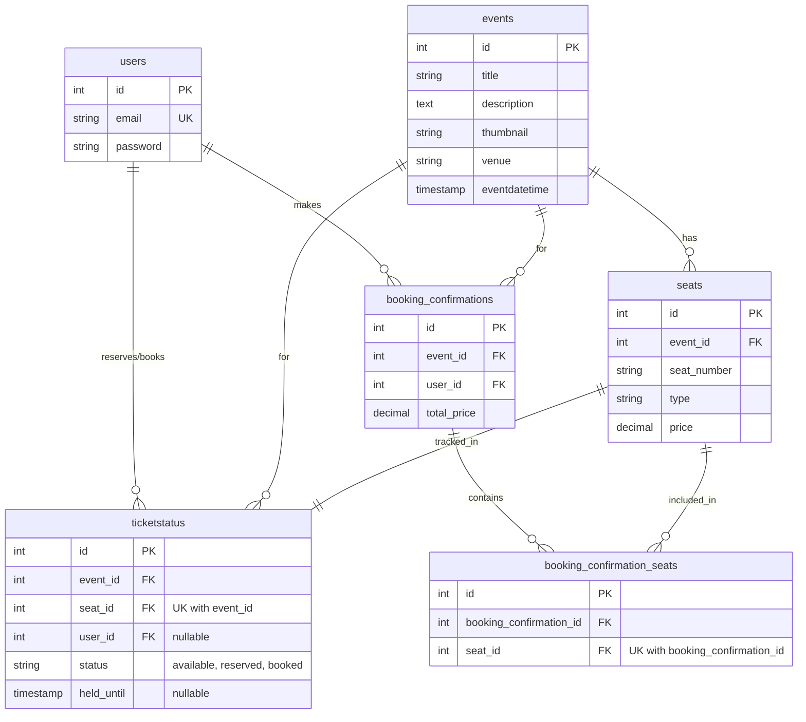

## 🚀 Backend API Setup Guide

### 📦 Database Setup

#### Step 1: Launch PostgreSQL Container

Run the following Docker command to create and start a PostgreSQL container:

```bash
docker run -d \
    --name node-postgres-db \
    -e POSTGRES_USER=postgres \
    -e POSTGRES_PASSWORD=postgres \
    -e POSTGRES_DB=ticket-booking-app \
    -p 5432:5432 \
    postgres
```

#### Step 2: Connect via pgAdmin

- Install [pgAdmin](https://www.pgadmin.org/download/)
- Create a new server connection with the following credentials:
  - **Host:** `localhost`
  - **Port:** `5432`
  - **Username:** `postgres`
  - **Password:** `postgres`
  - **Database:** `ticket-booking-app`

#### Step 3: Initialize Database Schema

Execute the `final-schema.sql` file (located in the project root) to create all required tables.

#### Step 4: Seed Sample Data

Run the `data-seed.sql` file to populate the database with sample data for testing and development.

---

> ✅ Your database is now ready to use!

### 🔧 API Setup

#### Step 1: Install Dependencies

Install the required packages using npm:

```bash
npm install
```

#### Step 2: Configure Environment Variables

Refer to the `.env.example` file and create a `.env` file with all the necessary environment variables.

#### Step 3: Start the Development Server

Run the following command to start the API server:

```bash
npm run dev
```

---

> ✅ Your API server is now running!

### Entity Relationship Diagram



### 🏗️ Architecture Decisions

#### 1. Concurrency Control and Prevent Double Booking

**Problem:** Without proper handling, two users could book the same seat.

**Solution: Atomic Operations**

```javascript
await pool.query("BEGIN");

try {
  const result = await pool.query(
    `UPDATE ticketstatus
         SET status = 'reserved',
             user_id = $1,
             held_until = NOW() + INTERVAL '10 minutes'
         WHERE seat_id = ANY($2::int[])
           AND event_id = $3
           AND (
              status = 'available'
              OR (status = 'reserved' AND held_until <= NOW())
          )
         RETURNING id, seat_id`,
    [userId, seatIds, eventId],
  );

  if (result.rows.length !== seatIds.length) {
    await pool.query("ROLLBACK");
    return [];
  }

  await pool.query("COMMIT");
  return seatIds;
} catch (error) {
  await pool.query("ROLLBACK");
  throw error;
}
```

**Key Points:**

- The `WHERE` clause performs the availability check **atomically** with the update
- PostgreSQL's row-level locking ensures only one `UPDATE` succeeds
- If fewer rows are returned than requested, some seats were unavailable. Then we rollback the transaction and return the error message to the user.
